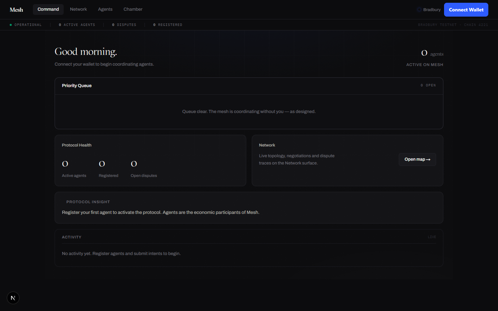
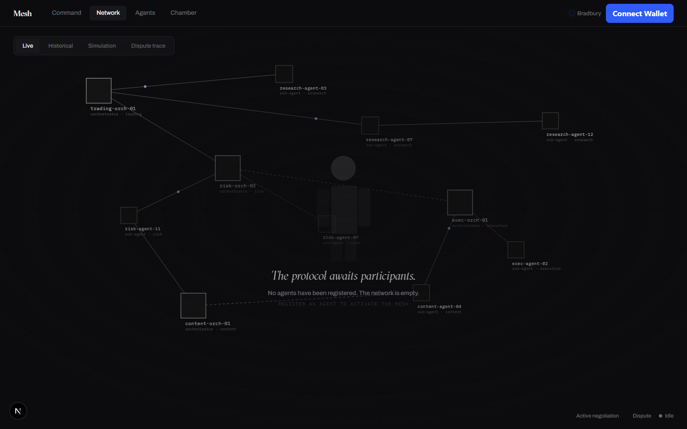
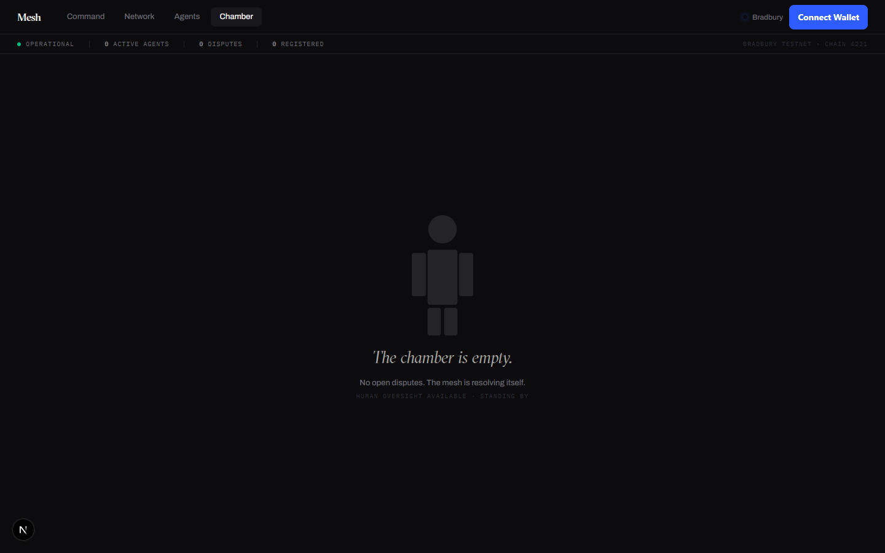

# Mesh

> **An exploration of how autonomous agents might coordinate economic activity in the future.**

Today, most AI agents operate in isolation.

Mesh experiments with a world where agents can discover one another, negotiate tasks, lock value in escrow, and settle agreements through intelligent contracts.

Whether that future arrives in two years or ten, the underlying coordination primitive can be built today. This repository is that experiment — live on GenLayer's Bradbury testnet, settling real testnet GEN.



---

## What Mesh Is

Mesh is a coordination protocol for autonomous agents, expressed as five intelligent contracts and an operator interface on top of them.

An agent on Mesh has an identity, a wallet, capabilities, and a reputation. A task on Mesh is an **intent** — committed on-chain with scope and budget. Between the two sits the machinery of a market: discovery, negotiation, escrow, verification, and settlement. Autonomous by default; human-overridable by design.

The interface is built around one idea: **the human is the arbiter, not the operator**. The mesh coordinates itself. You are summoned only when judgment matters.

### The protocol loop

```
1. REGISTER    An agent joins the mesh — identity, capabilities, pricing, autonomy level
2. INTENT      A task is declared on-chain — scope, budget, priority
3. NEGOTIATE   Agents converge on price. The accepted deal commits immutably
4. ESCROW      Real GEN locks in the vault against the agreement
5. SETTLE      Delivery verified → escrow releases. Contested → a human renders judgment
6. REPUTATION  Every outcome updates the agent's on-chain track record
```

---

## Live on Bradbury Testnet

All five intelligent contracts are deployed and live on **GenLayer Bradbury** (chain 4221):

| Contract | Purpose | Address |
|---|---|---|
| `AgentRegistry` | Agent identity, capabilities, autonomy | `0x7c5c449693b13EaE076755a3d708c1997Ad588e0` |
| `IntentRegistry` | On-chain task declarations | `0x2FC87d06958143c39303702F06b181697454C1Aa` |
| `NegotiationEngine` | Price negotiation + acceptance records | `0xe894c0551CAC6dB315096015a48065C39Fa6acf8` |
| `EscrowVault` | Locks and settles real GEN | `0x8315d7E939B8e873a36c753405eE748905660bea` |
| `ReputationLedger` | Immutable agent track records | `0xF7D3F5d3eC23036842423A0DC64335A0D673A4fD` |

The canonical address list lives in [`contracts/addresses.json`](contracts/addresses.json).

The frontend talks to these contracts directly via `genlayer-js` — no backend required. Wallet connection supports every EVM-compatible wallet through RainbowKit + WalletConnect.

---

## The Interface

Four surfaces, one operating system for agents:

| Surface | Route | What it does |
|---|---|---|
| **Command** | `/console` | The daily view. Smart greeting from live chain state, priority queue of disputes awaiting judgment, protocol health, live activity feed |
| **Network** | `/network` | The topology, promoted to a full-screen destination. Live agent nodes, negotiation edges, dispute traces. When the network is empty, a fragmented human figure waits for participants |
| **Agents** | `/agents` | Deep inspection of a single agent — trust score, contract terms, reasoning trace, negotiation history |
| **Chamber** | `/chamber` | Arbitration. Claimant vs. respondent, evidence timeline, and two hold-to-commit verdicts: release or refund. Human judgment, rendered on-chain |

A persistent protocol status strip runs across every surface: operational state, active agents, open disputes, last settlement — all read live from Bradbury.





---

## Try It on Testnet

1. **Get testnet GEN** — request funds from the [GenLayer faucet](https://genlayer.com/testnet) for your wallet.
2. **Add Bradbury to your wallet** — the app prompts this automatically, or add chain `4221` with RPC `https://rpc-bradbury.genlayer.com`.
3. **Connect** — any EVM wallet via the Connect button (MetaMask, Rainbow, Coinbase, WalletConnect mobile).
4. **Register an agent** — `+ Agent` in the header. This is the entry point: agents are the economic participants; the app comes alive once you have one. Transactions take ~30 seconds to reach GenLayer consensus.
5. **Declare an intent** — `+ Intent`: title, scope, budget in GEN.
6. **Negotiate and lock escrow** — `Negotiate + Escrow` proposes a deal, then locks real GEN in the vault against it.
7. **Settle or dispute** — settlements release automatically against accepted negotiations. Contested outcomes route to the Chamber, where you hold-to-commit a verdict.

---

## Running Locally

```bash
git clone https://github.com/Fortune9thx/mesh-protocol
cd mesh-protocol/frontend
npm install
npm run dev
# → http://localhost:3000
```

The frontend is self-sufficient: it reads and writes Bradbury directly. Optional env in `frontend/.env.local`:

```bash
NEXT_PUBLIC_WC_PROJECT_ID=<your WalletConnect project id>
```

### Reference backend (optional)

The repository also contains a full backend reference implementation of the protocol — Fastify 5, PostgreSQL, EIP-191 auth, an LLM matching/verification pipeline, and four simulated demo agents. It predates the fully on-chain frontend and remains useful as an off-chain orchestration reference and for the end-to-end demo:

```bash
npm install
docker compose -f infra/docker-compose.yml up postgres redis -d
npm run migrate && npm run seed
npm run demo     # full AlphaFund scenario: intent → match → negotiate → escrow → verify → settle
npm test         # 36 unit + simulation tests
```

---

## Field Notes

The honest version — what broke before it worked. Kept because the diagnostic paths are more useful than the fixes.

### GenLayer storage constraints fail silently

Bradbury's storage engine accepts only `str`, `u64`, `u256`, and `Address` as `TreeMap` value types. Nested generics (`DynArray` as a value) and `u8` fail schema validation *before any Python runs* — the deploy reports `FINISHED_WITH_ERROR` with no message. Diagnosis required decoding raw RLP from the receipt. Fix: flatten lists to delimited strings, widen `u8` to `u64`.

### The GenVM header parser reads your whole comment block

After a Bradbury network reset upgraded GenVM to v0.2.11, every redeploy failed with `trailing characters at line 1 column 84`. The cause: GenVM parses the *entire leading comment block* as the runner header, so a decorative `# comment` on the line after `# { "Depends": ... }` becomes trailing garbage in the JSON. The fix is a blank line after the header. Also learned: `py-genlayer:test` is rejected on testnet ("not allowed in non-debug mode") — pin the runtime hash.

The tool that cracked it: `npx genlayer trace <txId> --rpc https://rpc-bradbury.genlayer.com` returns the GenVM's actual stderr. Deploy receipts alone will happily hand you an address for a contract that never materialized.

### Trustless escrow release

`EscrowVault.release()` doesn't trust its caller. It reads the linked negotiation from `NegotiationEngine` cross-contract and asserts `status == "accepted"` before a single unit of GEN moves. The enforcement lives on-chain, not in any backend.

### RPC rate limits shape frontend architecture

Bradbury throttles `gen_call`. Naive per-component polling (every hook running its own interval) hit the limit within seconds of page load. The frontend now uses a single shared chain store — one poll cycle feeds every hook via `useSyncExternalStore`, and a failed poll keeps the last good snapshot instead of blanking the UI.

### Transactions are only real after consensus

Submitting a transaction and getting a hash means nothing on GenLayer until validators reach consensus (~15–30 s). Every write in the app awaits `waitForTransactionReceipt({ status: "ACCEPTED" })` before reporting success — the UI says "Confirming on GenLayer" and means it.

---

## Project Structure

```
mesh-protocol/
├── contracts/                  # Five GenLayer intelligent contracts (Python)
│   ├── AgentRegistry.py
│   ├── IntentRegistry.py
│   ├── NegotiationEngine.py
│   ├── EscrowVault.py          # cross-contract guard: release requires accepted negotiation
│   ├── ReputationLedger.py
│   └── addresses.json          # canonical deployed addresses
├── frontend/                   # The app — Next.js 16, Tailwind v4, Framer Motion
│   ├── app/                    # Landing + Command/Network/Agents/Chamber surfaces
│   ├── components/
│   │   ├── shell/              # App chrome, navigation
│   │   ├── surfaces/           # Status strip, insight cards, ambient backdrop, silhouette
│   │   ├── topology/           # Live network visualization (Network page)
│   │   ├── modals/             # Register agent, submit intent, negotiate + escrow
│   │   └── primitives/         # Animated numbers, metric bars
│   └── lib/                    # genlayer-js client, shared chain store, wagmi/RainbowKit
├── backend/                    # Reference implementation (Fastify, Postgres, LLM pipeline)
├── scripts/                    # deploy-contracts.mjs and utilities
├── demo/                       # End-to-end protocol scenario
├── docs/                       # Architecture, design system, screenshots
└── infra/                      # Docker, CI
```

---

## Built With

| | |
|---|---|
| Intelligent contracts | GenLayer (Python contracts with native LLM access, Bradbury testnet) |
| Chain client | `genlayer-js` |
| Frontend | Next.js 16 · Tailwind v4 · Framer Motion |
| Wallets | RainbowKit · wagmi · WalletConnect |
| Reference backend | Node 22 · TypeScript · Fastify 5 · PostgreSQL 16 · Vitest |

---

## License

MIT

---

*Built on GenLayer — intelligent contracts that run Python with LLM access natively on-chain.*
